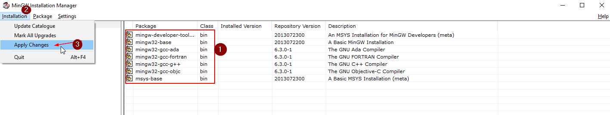
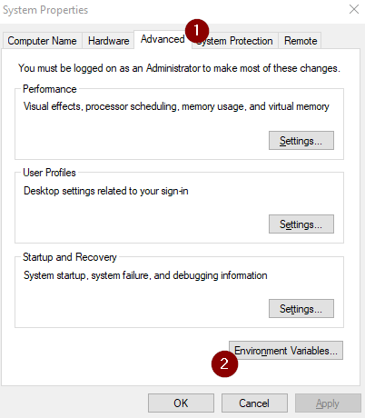
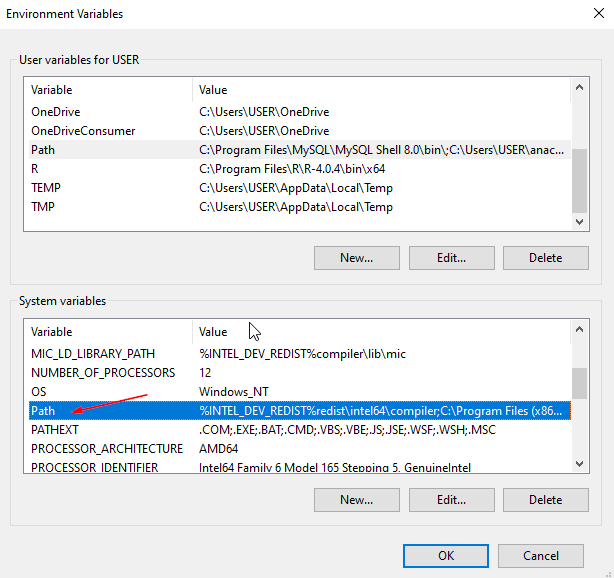
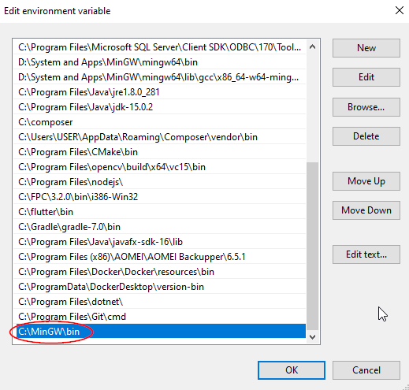
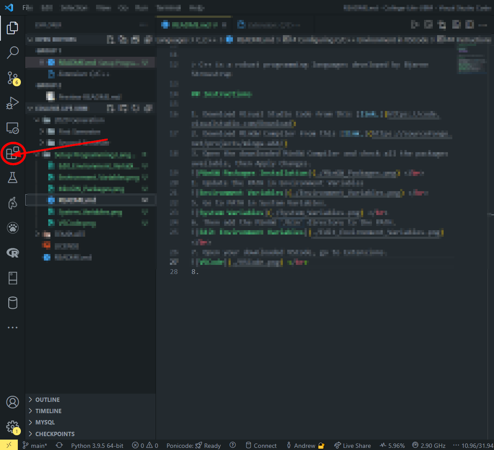
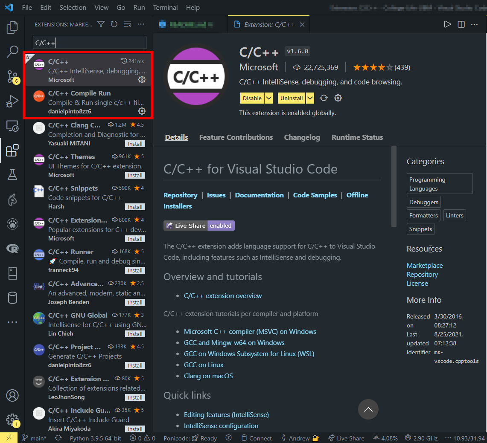
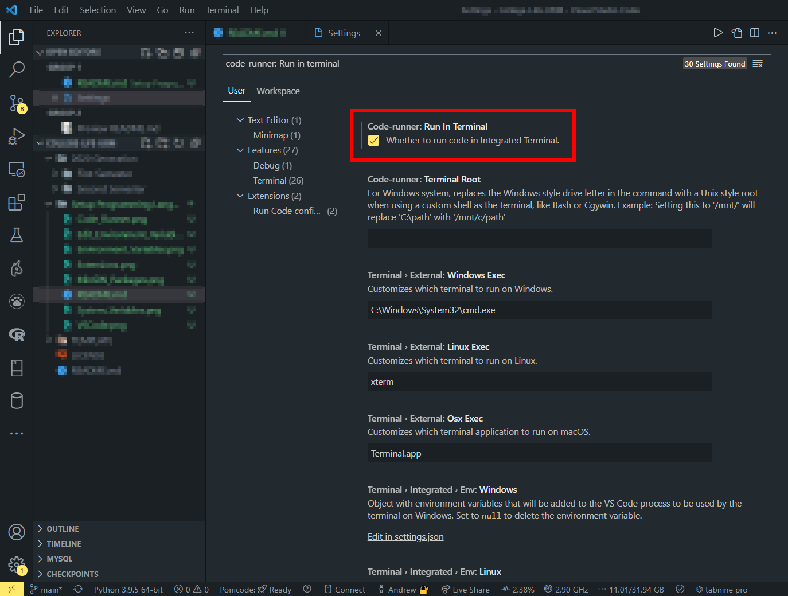
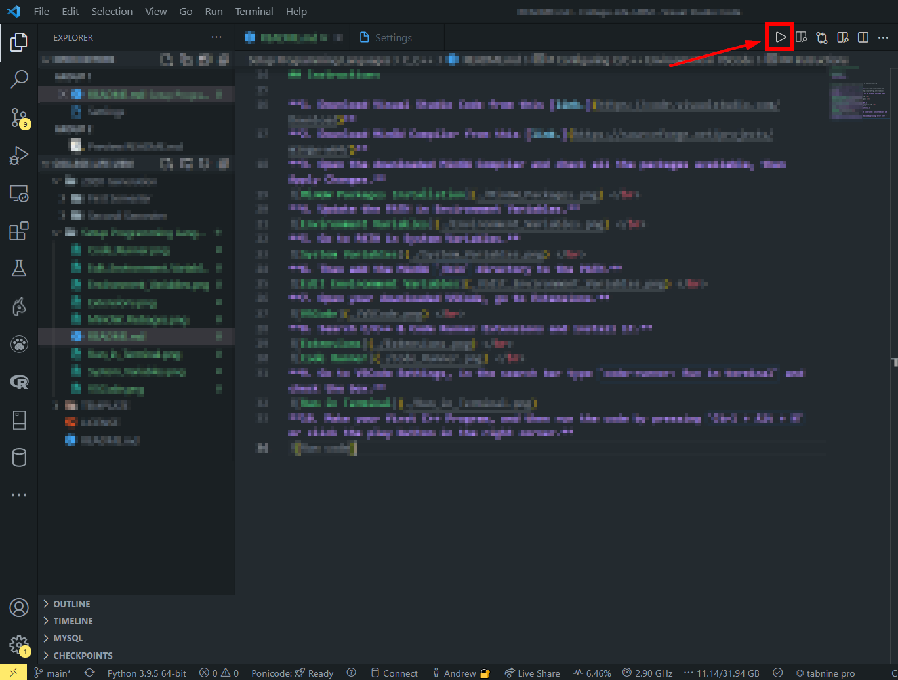

# Configuring C/C++ Environment in VSCode
---

## Tested: Windows 10
## Requirements:
- **MinGW Compiler**
- **Visual Studio Code** 
- **C/C++ Extensions**

---

> C++ is a general-purpose programming languages developed by Bjarne Stroustrup. C++ was initially known as "C with classes" and was renamed C++ in 1983. C++ is used for Game Development, Reverse Engineering, Database, Desktop Application, Servers and many more. Usually, C++ is used to teach programming in college.

## Syntax of C++

```
#include <iostream>

int main()
{
    std::cout << "Hello World" << std::endl;

    return 0;
}
```

## Instructions

**1. Download Visual Studio Code from this [link.](https://code.visualstudio.com/Download)** </br>
**2. Download MinGW Compiler from this [link.](https://sourceforge.net/projects/mingw-w64/)** </br>
**3. Open the downloaded MinGW Compiler and check all the packages available, then Apply Changes.** </br>
 </br>
**4. Update the PATH in Environment Variables.** </br>
 </br>
**5. Go to PATH in System Variables.** </br>
 </br>
**6. Then add the MinGW `/bin` directory to the PATH.** </br>
 </br>
**7. Open your downloaded VSCode, go to Extensions.** </br>
 </br>
**8. Search C/C++ & Code Runner Extensions and install it.** </br>
 </br>
 </br>
**9. Go to VSCode Settings, in the search bar type `code-runner: Run in terminal` and check the box.** </br>
 </br>
**10. Make your first C++ Program, and then run the code by pressing `Ctrl + Alt + N` or click the play button in the right corner.** </br>
 </br>
